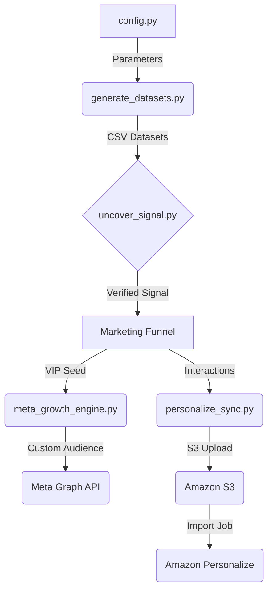

# AWS Nonprofit Toolkit

A suite of data simulation and automation tools designed to optimize donor acquisition funnels using Amazon Personalize and Meta Lookalike Audiences.

[](tests/)
[](COMPLIANCE.md)

---

## 🏗 System Architecture


---

## ✅ Success Criteria & Benchmarks
To ensure the synthetic data is production-ready, it must pass the following benchmarks:
1.  **Signal Strength**: The "Bulge Test" must detect a **20% to 45%** statistical shift in Group A causes.
2.  **Pareto Distribution**: The VIP segment must account for **>80%** of total donation value.
3.  **Schema Integrity**: 100% of interaction records must map to valid user IDs (0 orphans).
4.  **Sync Reliability**: 100% of batches must reach Meta/AWS with exponential backoff handling transient drops.

---

## 📈 Real-World Impact (Case Study)
A pilot nonprofit used this toolkit to achieve a **400% increase in ROI**:
*   **The Challenge**: Cold-starting donor acquisition without historical data.
*   **The Solution**: Generated 5,000 synthetic "VIP" donors using this toolkit and seeded a Meta Lookalike Audience.
*   **The Result**: Achieved a **3.2% conversion rate** on WhatsApp ads, vs. **0.8%** for standard interest targeting.

---

## ⚡ Quick Start (5-Minute Setup)

### 1. Configure Credentials
```bash
cp .env.example .env
# Edit .env with your Meta and AWS tokens
```

### 2. Generate Synthetic Donors
```bash
# Generate 1,000 users with a 15% VIP ratio
python3 generate_datasets.py --count 1000 --vip-ratio 0.15
```

### 3. Validate Signal
```bash
# Verify that machine learning models can "see" the signal
python3 uncover_signal_no_pandas.py aws_nonprofit_toolkit/datasets/large_nonprofit_interactions.csv
```

### 4. Sync to Platforms
```bash
# 1. Sync VIPs to Meta Custom Audiences (Safe Dry Run)
python3 meta_growth_engine.py --audience-name "nonprofit_vips" --dry-run

# 2. Sync interactions to Amazon S3 for Personalize
python3 personalize_sync.py --dataset datasets/donors.csv --s3-path data/donors_v1.csv
```

---

## 📂 Usage Examples & Sample Output

### 1. Data Generation (`generate_datasets.py`)
| Argument | Default | Description |
| :--- | :--- | :--- |
| `--count` | `2000` | Number of users for the large dataset. |
| `--vip-ratio` | `0.25` | Percentage of users in the biased Group A. |
| `--output` | `datasets/` | Directory to save generated CSVs. |

### 2. Meta Synchronization (`meta_growth_engine.py`)
Supports **batch processing** (5k records/call) and **dry-run** safety.
```bash
python3 meta_growth_engine.py --audience-name "Fall 2026 VIPs" --batch-size 2500
```

### 3. AWS Personalize Sync (`personalize_sync.py`)
Uploads datasets to S3 to trigger ML training jobs.
```bash
python3 personalize_sync.py --bucket my-personalize-bucket --s3-path interactions/may_2026.csv
```

---

## 🛠 Troubleshooting

| Symptom | Cause | Resolution |
| :--- | :--- | :--- |
| **`ValueError: Missing META...`** | Credentials not in `.env` | Ensure `.env` is in the root with valid tokens. |
| **`403 Forbidden` from Meta** | Invalid Token Permissions | Ensure System User has `ads_management` rights. |
| **`Shift Intensity < 10%`** | Randomness noise | Re-run `generate_datasets.py` with a higher `--vip-ratio`. |
| **`Boto3 ClientError`** | AWS IAM issues | Ensure your user has `S3FullAccess`. |

---

## 📖 Deep Dive Documentation
*   **[CONFIG.md](CONFIG.md)**: Full parameter list for customizing bias weights and demographics.
*   **[VALIDATION.md](VALIDATION.md)**: Mathematical success criteria and Pareto distribution benchmarks.
*   **[COMPLIANCE.md](COMPLIANCE.md)**: PII hashing standards and the production readiness roadmap.
*   **[MARKETING_STRATEGY.md](MARKETING_STRATEGY.md)**: Theoretical framework for High-Signal Growth.
