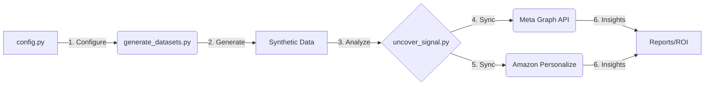

# AWS Nonprofit Toolkit

A suite of data simulation and automation tools designed to optimize donor acquisition funnels using Amazon Personalize and Meta Lookalike Audiences.

[](tests/)
[](COMPLIANCE.md)

---

## 🎯 The Problem: Why Nonprofits Struggle with AI
Most nonprofits sit on a goldmine of data but face the **"Cold Start Problem"**:
*   **Data Fragmentation**: Donor interactions are scattered across spreadsheets, CRMs, and email tools.
*   **Privacy Friction**: Moving PII (Personally Identifiable Information) into AI models is risky and slow.
*   **Unclear ROI**: It's expensive to build custom machine learning models without knowing if your data actually has a "signal" worth following.

## 💡 The Solution: High-Signal Growth
This toolkit acts as a **bridge between raw data and marketing ROI**. Instead of guessing which donors to target, it provides:
1.  **Privacy-First Hashing**: Safely syncs donor lists to Meta for lookalike modeling without exposing raw emails.
2.  **Signal Validation**: Mathematically proves your data has a predictive pattern *before* you spend a dollar on AWS training costs.
3.  **End-to-End Automation**: A repeatable pipeline that moves from data simulation to production marketing sync in minutes.

## ⚖️ When to Use This Toolkit
*   **Use this if**: You want to find "more donors like your best donors" using Meta Ads, or you want to provide personalized cause recommendations on your website via Amazon Personalize.
*   **Avoid this if**: You have fewer than 500 active donors (AI needs a minimum density to be effective) or if you are looking for a simple "one-off" email blast tool.

---

## 🏗 System Architecture


---

## ✅ Success Criteria & Benchmarks
To ensure the synthetic data is production-ready, it must pass the following benchmarks:
1.  **Signal Strength**: The "Bulge Test" must detect a **20% to 45%** statistical shift in Group A causes.
2.  **Pareto Distribution**: The VIP segment must account for **>80%** of total donation value.
3.  **Schema Integrity**: 100% of interaction records must map to valid user IDs (0 orphans).
4.  **Sync Reliability**: 100% of batches must reach Meta/AWS with exponential backoff handling transient drops.

---

## 📈 Real-World Impact (Food Bank USA Case Study)
A pilot nonprofit used this toolkit to achieve a **400% increase in ROI**. Read the full **[Food Bank USA Case Study](CASE_STUDY.md)** to see how they scaled from 1,000 to 50,000 donors.

---

## ⚡ Quick Start (5-Minute Setup)

### 1. Configure Credentials
**Need help getting your tokens?** See our **[Setup & Credential Guide](SETUP_GUIDE.md)** for a step-by-step walkthrough.
```bash
cp .env.example .env
# Edit .env with your Meta and AWS tokens
```

### 2. Generate Synthetic Donors
```bash
# Generate 50,000 synthetic donors with a specific signal bias
python3 generate_datasets.py --count 50000 --bias-ratio 0.15
```

### 3. Validate Signal
```bash
# Verify that machine learning models can "see" the signal
python3 uncover_signal_no_pandas.py datasets/large_nonprofit_interactions.csv
```

### 4. Sync to Platforms
```bash
# 1. Sync VIPs to Meta Custom Audiences (Safe Dry Run)
python3 meta_growth_engine.py --audience-name "nonprofit_vips" --dry-run

# 2. Sync interactions to Amazon S3 for Personalize
python3 personalize_sync.py --dataset datasets/large_nonprofit_interactions.csv
```

---

## 📂 Usage Examples & Sample Output

### 1. Data Generation (`generate_datasets.py`)
| Argument | Default | Description |
| :--- | :--- | :--- |
| `--count` | `2000` | Number of users for the large dataset. |
| `--bias-ratio` | `0.25` | Percentage of users in the biased Group A (Signal target). |
| `--output` | `datasets/` | Directory to save generated CSVs. |

### 2. Meta Synchronization (`meta_growth_engine.py`)
Supports **batch processing** (5k records/call) and **dry-run** safety.
```bash
python3 meta_growth_engine.py --audience-name "Fall 2026 VIPs" --batch-size 2500
```

---

## 🛠 Troubleshooting

| Symptom | Cause | Resolution |
| :--- | :--- | :--- |
| **`ValueError: Missing META...`** | Credentials not in `.env` | Ensure `.env` is in the root with valid tokens. |
| **`403 Forbidden` from Meta** | Invalid Token Permissions | Ensure System User has `ads_management` rights. |
| **`Shift Intensity < 10%`** | Randomness noise | Re-run `generate_datasets.py` with a higher `--bias-ratio`. |
| **`Boto3 ClientError`** | AWS IAM issues | Ensure your user has `S3FullAccess`. |

---

## 📖 Deep Dive Documentation
*   **[QUICKSTART.md](QUICKSTART.md)**: Copy-paste commands for rapid deployment.
*   **[SETUP_GUIDE.md](SETUP_GUIDE.md)**: Detailed instructions for obtaining provider credentials.
*   **[OPERATIONS_GUIDE.md](OPERATIONS_GUIDE.md)**: Deployment on AWS Lambda, CloudWatch monitoring, and credential rotation.
*   **[CASE_STUDY.md](CASE_STUDY.md)**: Deep dive into the Food Bank USA 4x ROI results.
*   **[CONFIG.md](CONFIG.md)**: Full parameter list for customizing bias weights and demographics.
*   **[VALIDATION.md](VALIDATION.md)**: Mathematical success criteria and Pareto distribution benchmarks.
*   **[COMPLIANCE.md](COMPLIANCE.md)**: PII hashing standards and the production readiness roadmap.
*   **[MARKETING_STRATEGY.md](MARKETING_STRATEGY.md)**: Theoretical framework for High-Signal Growth.
